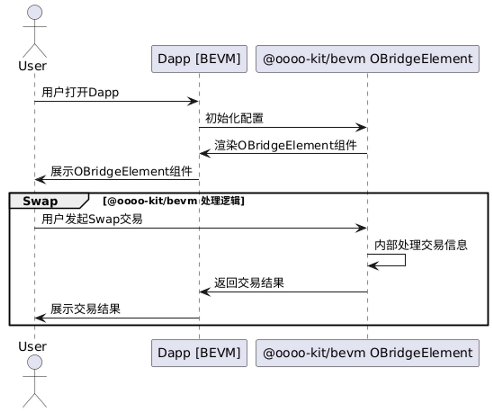
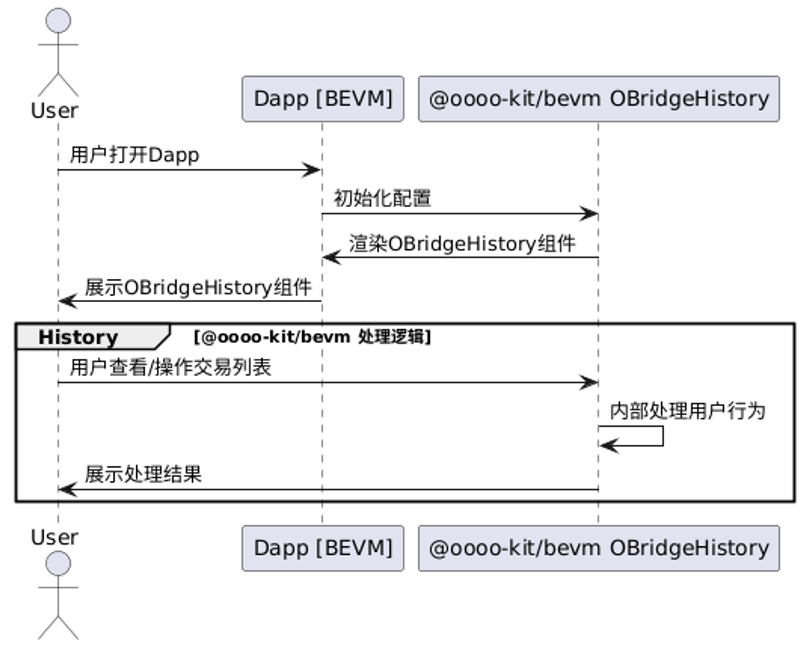

# @oooo-kit/bevm

## 概述

@oooo-kit是一个低代码的跨链桥集成方案, 它会在业务方的网站嵌入跨链桥支付, 方便业务方接入桥服务, 降低业务方的接入成本.

@oooo-kit将会以UI组件的形式嵌入到用户的Web应用程序中

## 快速入门

### 1. 安装 @oooo-kit/bevm 库

```bash
$ pnpm install @oooo-kit/bevm
```

### 2. 初始化


#### 样式初始化

```ts
import '@oooo-kit/bevm/style.css'
```

#### OBridgeElement

```tsx
import { OBridgeElement } from '@oooo-kit/bevm'

export default () => {
	const options = {
		appId: '{{appId}}'
	}
	
	const walletAddress = '{{walletAddress}}'
	
	const provider = window.ethereum

	return <OBridgeElement walletAddress={walletAddress} provider={provider} options={options} />
}
```

#### OBridgeHistory

```tsx
import { OBridgeHistory } from '@oooo-kit/bevm'

export default () => {
	const options = {
		appId: '{{appId}}'
	}
	
	const walletAddress = '{{walletAddress}}'
	
	const provider = window.ethereum

	return <OBridgeHistory walletAddress={walletAddress} provider={provider} options={options} />
}
```

## 详细文档

### OBridgeElement

#### 时序图



#### API

| Prop | Description |
| --- | --- |
| walletAddress | 当前活跃的钱包地址 |
| provider | 当前活跃钱包的Ethereum Provider |
| options | OBridgeElement 配置项. https://www.notion.so/oooo-kit-bevm-SDK-abc6169a21e943779d2424b9280d4aea?pvs=21 |

**Options**

| Prop | Description |
| --- | --- |
| appId | 指定业务方的appId |

**Events**

| Name | Description | Argument |
| --- | --- | --- |
| onSucceed | 用户创建交易单成功后触发 | Transaction |
| onFailed | 用户创建交易单失败后触发 | OBridgeError |

**Transaction**
| Name            | Description            |
| --------------- | ---------------------- |
| createTime      | 交易单创建时间         |
| fromChainName   | 用户发起转账的链名称   |
| fromAssetType   | 用户发起转账的资产类型 |
| fromAssetCode   | 用户发起转账的资产     |
| fromWalletAddr  | 用户发起转账钱包地址   |
| fromTxnHash     | 用户发起转账的交易hash |
| fromSwapAmount  | 用户发起转账金额       |
| fromStatus      | 用户发起转账订单状态   |
| toChainName     | 目的链名称             |
| toAssetType     | 目的资产类型           |
| toAssetCode     | 目的资产               |
| toWalletAddr    | 目的收款钱包地址       |
| toSwapAmount    | 目的收款金额           |
| toTxnHash       | 目的交易hash           |
| toStatus        | 目的订单状态           |
| binancePayOrder | Binance Pay订单信息 |

**OBridgeError**
| Name | Description    |
| ---- | -------------- |
| code | 错误码, 基于[EthersError](https://docs.ethers.org/v6/api/utils/errors/)上新增了`O_RESPONSE_ERROR`错误码管理@oooo-kit内部的接口请求错误 |
| message | 由@oooo-kit处理过的错误信息 |
| rawError | 原始的, 未被处理过的错误数据 |

### OBridgeHistory

用户交易历史列表组件, 用于展示用户通过@oooo-kit/bevm创建的交易单信息

#### 时序图



#### API

| Prop | Description |
| --- | --- |
| walletAddress | 当前活跃的钱包地址 |
| provider | 当前活跃钱包的Ethereum Provider |
| options | OBridgeHistory 配置项. https://www.notion.so/oooo-kit-bevm-SDK-abc6169a21e943779d2424b9280d4aea?pvs=21 |

**Options**

| Prop | Description |
| --- | --- |
| appId | 指定业务方的appId |

## 常见问题 (FAQ)

Q: @oooo-kit 组件嵌入形式是什么样的?

A: @oooo-kit 组件会以UI组件的形式嵌入, 组件的宽度基于容器宽度, 高度基于内容高度
